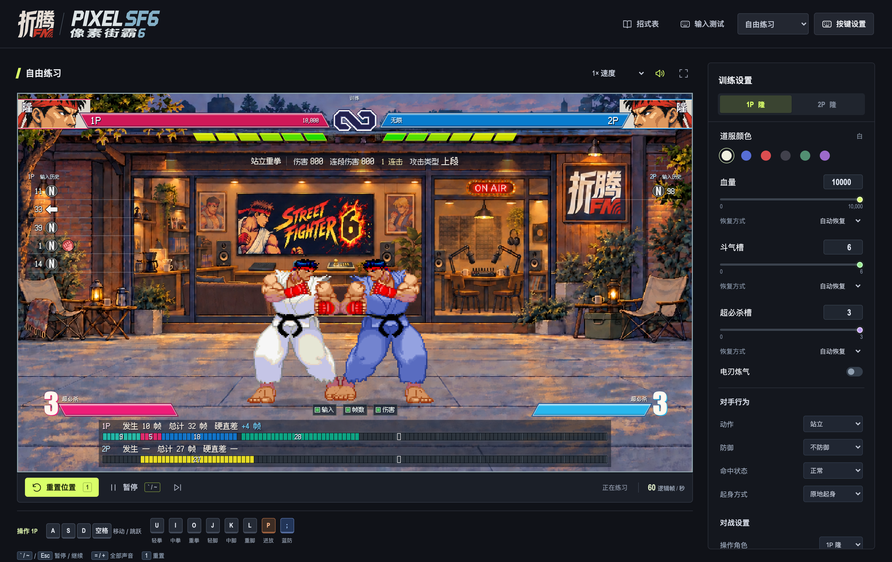
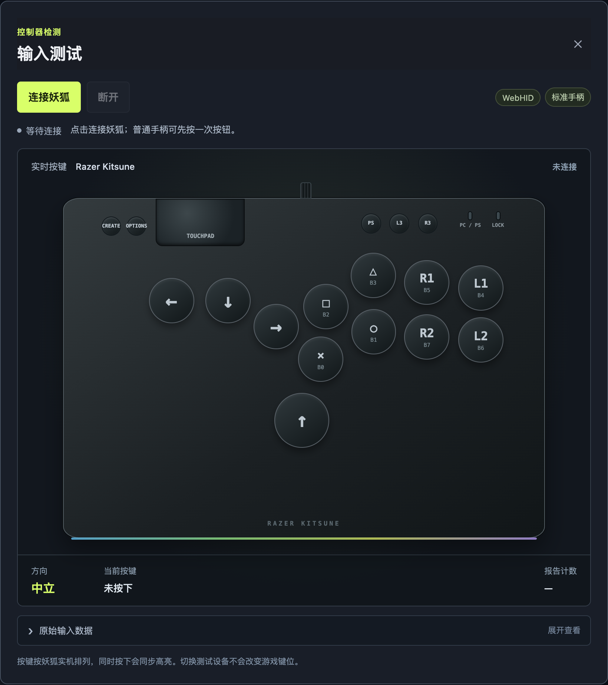

# 像素街霸6 · Pixel SF6

使用 Codex 制作的网页单机**像素版《街霸6》**，招式与帧数参考 [CAPCOM 官方帧数表](https://www.streetfighter.com/6/en-us/character/ryu/frame)，画风参考《街霸 3.3》。

**角色支持**：隆

**模式支持**：练习场模式 · 同机双人对战 · 1–8 级 AI 对战

**设备支持**：键盘、手柄、HitBox（针对 Mac 端，雷蛇妖狐做过单独适配）

**[在线体验](https://icodyyang.github.io/pixel-sf6/) · [下载游戏](#下载游戏)**

## 为什么做像素街霸6

家中所有的电脑全是 Mac。平时街霸一般都在 PS5 上玩，因为支持 PS5 的 Hitbox 不多，所以用的是雷蛇妖狐 Hitbox。

偶尔出差的时候，如果网络好，通过串流 PS5 还可以玩一玩；但大部分酒店的网络用来串流还是差点意思（玩其他游戏还行，但是对于像街霸这种对帧数敏感的游戏还是有点吃力），所以就想在本地离线运行。

之前尝试过 Steam Deck，虽然能玩，但是太大了，带出去过一次之后就再也不想带出去了。所以最好的办法还是在 Mac 上街霸6。目前新版的 CrossOver 在 Mac 上降低画质，确实可以稳定跑到 60 帧，但每次从启动到能玩上，中间经历的时间太漫长了。

我就想有没有办法能点开即玩，哪怕只是简单按一按、能练一些简单的连段也可以。

于是就有了像素街霸6

## 下载游戏

下载 [index.html](index.html)，双击用桌面浏览器打开。等待素材载入，点击场地或按一下键，即可练习和播放声音。

**只需要这一个 HTML，所有游戏素材已内嵌，无需安装依赖，也不需要启动服务器。** 从 GitHub 下载时，请保存实际 HTML 文件，不要保存文件预览页面。

### 默认键位

| 操作                  | 1P               | 2P（双人对战） |
| --------------------- | ---------------- | -------------- |
| 左 / 蹲下 / 右 / 跳跃 | A / S / D / 空格 | ← / ↓ / → / ↑  |
| 轻 / 中 / 重拳        | U / I / O        | R / T / Y      |
| 轻 / 中 / 重脚        | J / K / L        | F / G / H      |
| 投技                  | U＋J             | R＋F           |
| 斗气迸放 / 蓝防       | P / 分号 `;`     | V / B          |

| 操作 | 默认快捷键 |
| --- | --- |
| 暂停 / 继续 | `~` / `Esc` |
| 静音 / 恢复声音 | `=` |
| 重置位置 | `1` |
| 重置到左 / 右版边 | 按住 1P 左（`A`）/ 右（`D`），再按 `1` |
| 重置到版边并交换站位 | 按住 1P 左下（`A`＋`S`）/ 右下（`D`＋`S`），再按 `1` |
| 重置到中央 | 按住 1P 下（`S`），再按 `1` |
| 重置到中央并交换站位 | 按住 1P 跳跃（`空格`），再按 `1` |

组合重置使用 1P 的方向键位，左右以屏幕方向为准。方向组合会记住新的重置位置，之后单按 `1` 继续使用该位置，直到通过另一组快捷键或菜单更改。全部可修改的键位都在「按键设置」中，`Esc` 保留为暂停。

招式表可查指令和演示。数字 `6 / 2 / 3 / 4` 分别表示前 / 下 / 前下 / 后；左右换边自动镜像。OD 使用对应指令＋双拳或双脚；蓝防中前前可绿冲，可取消普通技接触后也可前前取消绿冲。CA 需要三格超必杀槽，且血量不高于 2,500。

### 训练与画面设置

- **调整练习条件**：双方配色、血量、斗气和超必杀槽；支持无限、自动恢复等资源设置。对手可设防御、起身方式，以及起身 / 防御后 / 受击后的反击。
- **练习连段确认**：「首击后防御」允许第一下命中，真连段中继续受击，断连后则会防御；双方回到中立约 1 秒后可开始新一轮，也可手动重置。
- **查看反馈**：输入历史、帧数条、伤害统计，支持独立开关；帧数条和伤害显示可调不透明度。也有慢速、单帧前进和判定框。
- **选择场景与声音**：折腾 FM 游戏大厅、像素练习场和朱雀城；场景动效、BGM 与招式音量分别设置。
- **实时帧率（FPS）**：开关位于「训练设置 → 画面显示」。它显示浏览器的**渲染帧率**，所以可能是 120 FPS；正常速度下战斗仍按每秒 60 个逻辑帧推进，招式不会加速。

设置会自动保存在当前浏览器本地，刷新或再次打开时恢复；清除网站数据会重置这些设置。

### 设备支持

支持**键盘、Hitbox 和手柄**，可在「按键设置」中自定义操作和两台控制器的映射，并通过「输入测试」查看方向与按钮。额外针对**雷蛇妖狐（Razer Kitsune）**做了 Mac 适配。

雷蛇妖狐连接 Mac 的方式：

1. 将妖狐的模式开关拨到 **PS 模式**，使用一根支持数据传输的 **USB-A 转 USB-C（Type-C）线**，Type-C 端接妖狐，USB-A 端接 Mac；如果 Mac 没有 USB-A 接口，可通过带 USB-A 接口的拓展坞连接。
2. 打开页面后先按一下实体按钮，再进入顶部的「输入测试」，确认上下左右与按键是否对应。
3. 若未自动识别，在浏览器中点击「连接妖狐」，选择 **Razer Kitsune** 并授权，然后回到场地练习。

雷蛇妖狐主要面向 PS5 和 Windows PC，插到 Mac 上并不一定能直接作为标准手柄使用。本项目补充了专用的网页输入映射，并提供 **WebHID 直连**，让妖狐能在本项目中用于练习和对战；这属于网页内的适配，并不改变其他 Mac 游戏的兼容性。[WebHID](https://developer.chrome.com/docs/capabilities/hid) 直连需要浏览器支持，建议使用桌面端 Chrome / Edge。

双人模式为**同一台电脑对战**，可混用键盘和控制器。设备兼容性取决于设备、系统和浏览器；自制 AI、判定、距离及像素动画与原版仍有差异，精确训练请以原版为准。

## 使用与版权声明

本项目由 **折腾FM** 制作并维护

[折腾FM](https://space.bilibili.com/210202907) 是一档关于折腾的人物访谈播客。折腾就是认真玩；认真玩，本身就是一种浪漫。

**本项目仅供个人学习与使用，无任何盈利目的，禁止任何形式的商业使用。**

《街头霸王》系列、隆及相关游戏美术、音乐、音效和商标的权利归 CAPCOM（卡普空）及相应权利人所有。本项目为非官方同人练习工具，与 CAPCOM 无隶属、赞助或授权关系。
